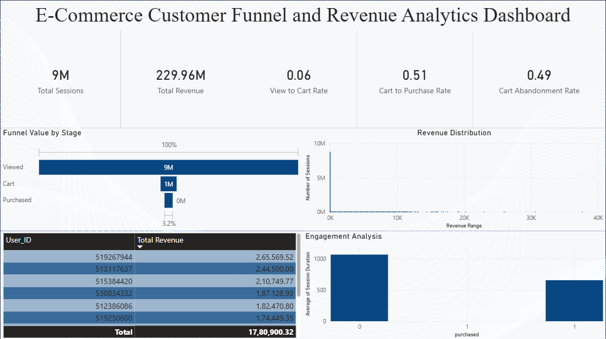

# E-commerce Funnel & Revenue Analytics Dashboard

## Project Overview

This project presents an end-to-end data analytics pipeline to analyze user behavior on an e-commerce platform. Using a large-scale dataset (~42 million records), the project identifies conversion bottlenecks, user engagement patterns, and revenue distribution using SQL, Python, and Power BI.

---

## Problem Statement

E-commerce platforms often face:

- Low conversion rates from product views to purchases  
- High cart abandonment  
- Limited visibility into user behavior across sessions  

This project aims to answer:

- Where do users drop off in the funnel?  
- How efficient is the checkout process?  
- What defines high-value users?  
- How does engagement impact conversions?  

---

## Tech Stack

- PostgreSQL (Database)
- SQL (Data cleaning, aggregation, analysis)
- Python (Pandas, Matplotlib, Seaborn for EDA)
- Power BI (Dashboard and visualization)

---

## Data Pipeline

1. Raw Data Ingestion  
   - Event-level dataset containing user actions (view, cart, purchase)

2. Data Cleaning  
   - Handled null values  
   - Standardized timestamps  

3. Aggregation  
   - Converted event-level data into session-level table  
   - Each row represents one user session  

4. Feature Engineering  
   - View, cart, purchase indicators  
   - Revenue per session  
   - Session duration  

5. Exploratory Data Analysis (Python) 
   - Distribution analysis
   - Initial funnel analysis  
   - Outlier detection  
   - Revenue analysis(Heavily skewed)  

7. Dashboarding (Power BI)  
   - KPI tracking  
   - Funnel visualization  
   - Revenue and engagement insights  

---

## Key Performance Indicators (KPIs)

- Total Sessions  
  9M sessions in total were worked with and analyzed

- Total Revenue  
  A total revenue of 229.6M was generated across all sessions

- View to Cart Conversion Rate  
  Only a ~6 perent of view to cart conversion rate

- Cart to Purchase Conversion Rate  
  51 percent of cart to purchase rate

- Cart Abandonment Rate  
  A 49 percent of items being added to cart and being abandoned

---

## Key Insights

- Significant drop-off occurs at the View to Cart stage, indicating weak product engagement  
- Cart to Purchase conversion is high (~51), suggesting a smooth checkout experience  
- Cart abandonment rate is ~49%, which highlights a loss of product engagement 
- Revenue distribution is highly skewed, with a small percentage of users contributing most revenue  
- Users who purchase tend to have shorter session durations, indicating high purchase intent  
- Some users bypass the cart stage, requiring sequential filtering for accurate funnel metrics  

---

## Dashboard

---

## How to Run

### SQL

Run the SQL script:

analysis_sql.sql

---

### Python

Install dependencies:

pip install -r requirements.txt  

Run notebook:

jupyter notebook python/Ecommerce_EDA.ipynb  

---

### Power BI

- Connect to PostgreSQL database  
- Refresh data
- dashboard.png can be used as a reference to model your own dashboard

---

## Key Learnings

- Transforming event-level data into session-level features is essential for scalable analytics  
- Funnel analysis requires enforcing sequential logic to avoid incorrect metrics  
- Handling outliers is critical for accurate behavioral analysis  
- Combining SQL, Python, and BI tools creates a complete analytics workflow  

---

## Conclusion

This project demonstrates how structured data modeling and visualization can uncover actionable insights in user behavior, helping businesses optimize conversion funnels and improve revenue performance.

---
